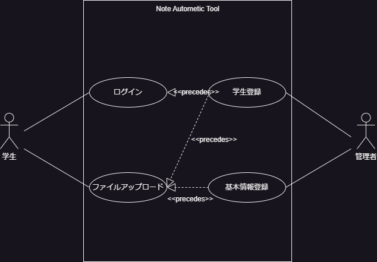

# VYD NAT(Note Automatic Tool)システム 要求仕様

    VYD  2023-06-19

## システムの目的

本システムの目的は，神戸大学工学部電気電子工学科情報通信研究室の会議においての発表題目や順番，日時等が書かれている資料の作成を自動化することである．

これまで神戸大学情報通信研究室では，サーバー管理者が発表者のスライドをすべて PDF に変換し，名前や題目等の発表の詳細などをすべて手動で作成してきた．研究室には全体で 20~30 名在籍しているため，ひとりで資料を作成するには負担が大きいことが課題であった．

そこで，PowerPoint をすべて自動で PDF に変換するツールと，スライドの発表者が名前，題目などの入力した情報を自動で一つのファイルにまとめるツールを作成する．これにより，ひとりひとりの負担は多少増えるものの，サーバー管理者の負担は大幅に軽減され，会議資料の作成が容易に達成される．

## システムの概要

本システムは，研究室内の論文や発表スライドなどを PDF に変換したうえで，内部サイトにアップロードする．

導入前は，各学生は自分の論文や発表スライドをサーバ管理者に送信する(チャットツール等で)．サーバ管理者は論文のタイトルなどを抽出し，発表スライドを
PDF に変換したうえで，研究室内部サーバに転送する．その後，Web サーバの HTML ファイルを編集する(ファイルへのリンク等)．

導入後は，各学生は論文や発表スライドを直接内部サーバに送る．その際は，scp コマンド等による転送ではなく，GUI でドラッグ&ドロップする形となる．
サーバはファイルがアップロードされると，自動で PDF に変換し，論文のタイトル等を抽出したうえで，HTML ファイルを更新する．
例えば，

`[抽出した著者名]<a href="path to the file">[抽出したタイトル名]</a><a href="path to the file">スライド</a>`

を自動生成する．

システムの導入により，ひとりひとりの負担は多少増えるものの，サーバー管理者の負担は大幅に軽減され，
自身の研究により集中することができる．

## 機能一覧

1. pptx→pdf 変換機能
   > pptx ファイルを pdf ファイルに変換する機能．あるディレクトリにある pptx ファイルを一括で pdf ファイルに変換．Windows 上で動作．
2. ファイルアップロード機能
   > ファイルをサーバにアップロードする機能．アップロードが完了すると，Web サーバ上の html ファイルが自動で更新される．
3. メタ情報抽出機能
   > アップロードされたファイルのファイル名，作成者を抽出する機能．ファイルが論文の場合はタイトルも抽出．

## ユースケース図

## ユースケース一覧

### ユースケース：ファイルをアップロードする．

**概要**

学生がファイル（この場合，卒論か修論の pdf と，その発表 pptx）をアップロードする．

**アクター**

学生

**事前条件**

- 学生が管理者に登録されていること．
- 学生がシステムにログインしていること．

**事後条件**

- アップロードしたファイルが，基本情報と紐づけられ，サイトに反映される．

**トリガー**

- 学生がファイルをフロントエンドからアップロードする．

**基本フロー**

1. 学生はシステムにログインする．
2. システムはファイルアップローダーを表示する．
3. 学生は自身の論文と発表スライドをアップロードする．
4. システムは，アップロード者と学生の情報を照合する．
5. システムは，発表スライドを pdf に変換する．
6. システムは，変更をフロントエンドファイルに反映させる．

### ユースケース：学生がログインする

**概要**
学生がログインする

**アクター**
学生

**事前条件**
アカウントがサーバ上に登録されていること．

**事後条件**
ログイン状態になる．ファイルアップロードが可能になる．

**トリガー**
学生が「ログイン」ボタンを押す．

**基本フロー**
1. 学生は，「ログイン」のボタンを押す．
2. サーバはログインページを表示する．
3. 学生は，IDとパスワードを入力して「ログイン」ボタンを押す．
4. サーバは送信されたIDでユーザを検索し，パスワードが一致するかチェックする．
5. パスワードが一致すれば，ユーザをログイン状態にする．
6. サーバはファイルアップロード画面を表示する．

**代替フロー1**
  - 4a.1 基本フロー4でIDが存在しない場合は，システムはログインエラーを出し，2に戻る．

**代替フロー2**
  - 5a.1 基本フロー5でパスワードが一致しない場合，システムはログインエラーを出し，2に戻る．

## GUI紙芝居