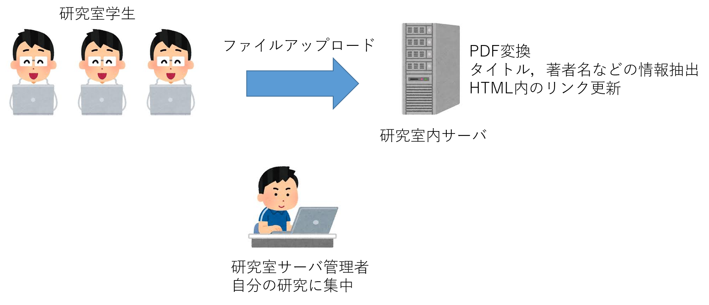

# システムの概要
本システムは，研究室内の論文や発表スライドなどをPDFに変換したうえで，内部サイトにアップロードする．

導入前は，各学生は自分の論文や発表スライドをサーバ管理者に送信する(チャットツール等で)．サーバ管理者は論文のタイトルなどを抽出し，発表スライドを
PDFに変換したうえで，研究室内部サーバに転送する．その後，WebサーバのHTMLファイルを編集する(ファイルへのリンク等)．


導入後は，各学生は論文や発表スライドを直接内部サーバに送る．その際は，scpコマンド等による転送ではなく，GUIでドラッグ&ドロップする形となる．
サーバはファイルがアップロードされると，自動でPDFに変換し，論文のタイトル等を抽出したうえで，HTMLファイルを更新する．
例えば，

```[抽出した著者名]<a href="path to the file">[抽出したタイトル名]</a><a href="path to the file">スライド</a>```
を自動生成する．
