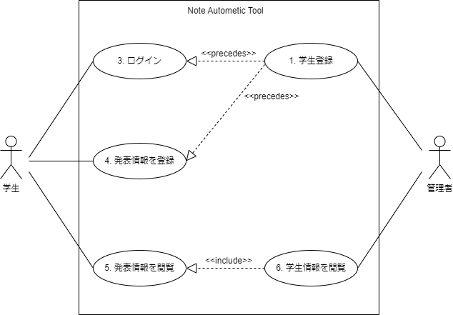

# ユースケース

## ユースケース図

## ユースケース一覧

- [1. 学生登録](./register.md)
- ~~2. 基本情報登録~~ 
- [3. 学生がログインする](./login.md)
- [4. 発表情報を登録する](./upload.md)
- [5. 発表情報を閲覧する](./presentation.md)
- [6. 学生情報を閲覧する](./students.md)
