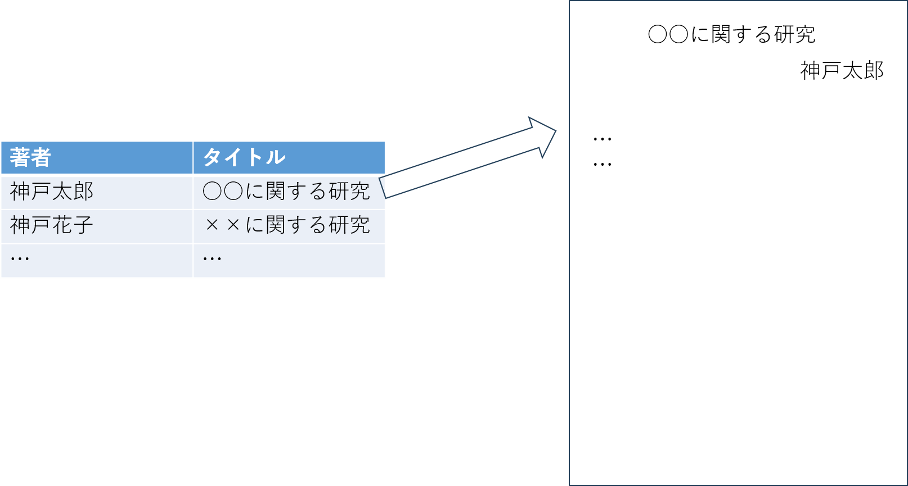

### ユースケース：発表情報を閲覧する．

**概要**

学生が自身及び他の学生の発表情報を閲覧する．

**アクター**

学生

**事前条件**

- 学生がシステムにログインしていること．

**事後条件**

- 自身及び他の学生の発表資料などが閲覧できる．

**トリガー**

- 学生がタイトルをクリックする．

**基本フロー**

1. 学生はシステムにログインする．
2. システムはこれまでにアップロードされている発表情報の一覧を表示する．
3. 学生は閲覧したい発表タイトルをクリックする．．
4. システムは，発表資料を表示する．

**UI イメージ**

