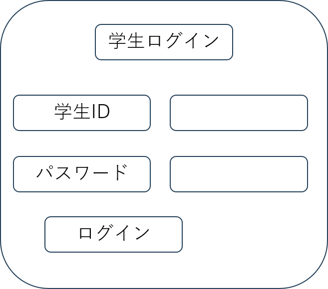

### ユースケース：学生がログインする

**概要**

学生がログインする

**アクター**

学生

**事前条件**

アカウントがサーバ上に登録されていること．

**事後条件**

ログイン状態になる．ファイルアップロードが可能になる．

**トリガー**

学生が「ログイン」ボタンを押す．

**基本フロー**

1. 学生は，「ログイン」のボタンを押す．
2. サーバはログインページを表示する．
3. 学生は，ID とパスワードを入力して「ログイン」ボタンを押す．
4. サーバは送信された ID でユーザを検索し，パスワードが一致するかチェックする．
5. パスワードが一致すれば，ユーザをログイン状態にする．
6. サーバはファイルアップロード画面を表示する．

**代替フロー 1**

- 4a.1 基本フロー 4 で ID が存在しない場合は，システムはログインエラーを出し，2 に戻る．

**代替フロー 2**

- 5a.1 基本フロー 5 でパスワードが一致しない場合，システムはログインエラーを出し，2 に戻る．

**UI イメージ**

