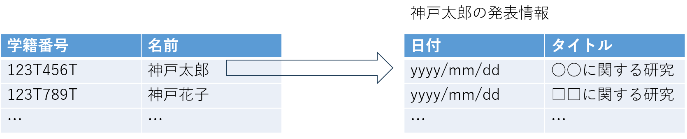

### ユースケース：学生情報を閲覧する．

**概要**

管理者が登録されている学生の情報を閲覧する．

**アクター**

管理者

**事前条件**

- 管理者としてログインしていること．

**事後条件**

- 登録済みの学生情報一覧が表示される．

**トリガー**

- 管理者が学生情報一覧ページにアクセスする．

**基本フロー**

1. 管理者が学生情報一覧ページにアクセスする．
2. システムは登録済みの学生情報を表示する．
3. 管理者は閲覧したい学生の名前をクリックする．
4. システムは，学生の学籍番号とこれまでの学生の発表情報を表示する．

**UI イメージ**

