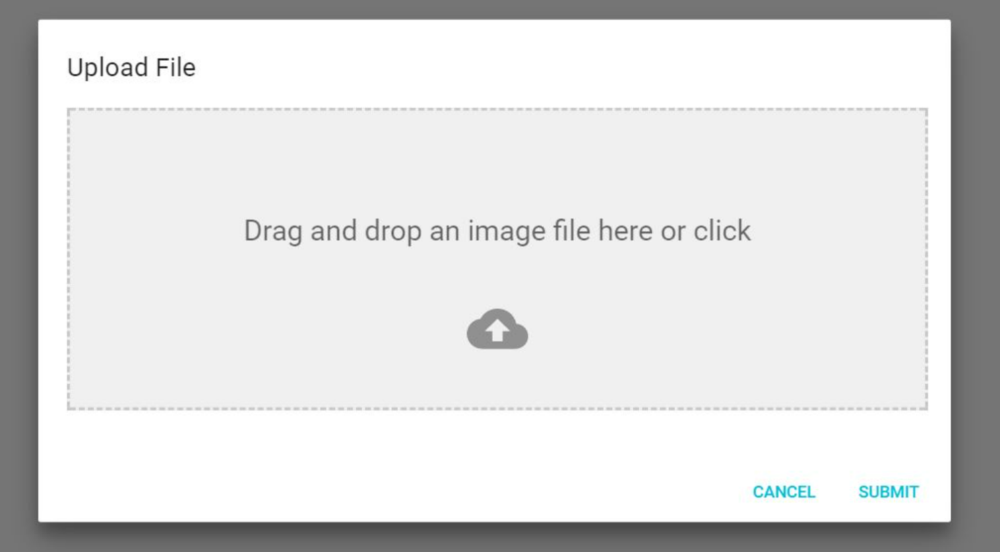

### ユースケース：ファイルをアップロードする．

**概要**

学生がファイル（この場合，卒論か修論の pdf と，その発表 pptx）をアップロードする．

**アクター**

学生

**事前条件**

- 学生が管理者に登録されていること．
- 学生がシステムにログインしていること．

**事後条件**

- アップロードしたファイルが，基本情報と紐づけられ，サイトに反映される．

**トリガー**

- 学生がファイルをフロントエンドからアップロードする．

**基本フロー**

1. 学生はシステムにログインする．
2. システムはファイルアップローダーを表示する．
3. 学生は自身の論文と発表スライドをアップロードする．
4. システムは，アップロード者と学生の情報を照合する．
5. システムは，発表スライドを pdf に変換する．
6. システムは，変更をフロントエンドファイルに反映させる．

**UI イメージ**

以下のようなものと同等なものを想定．

参照元：https://yuvaleros.github.io/material-ui-dropzone/
